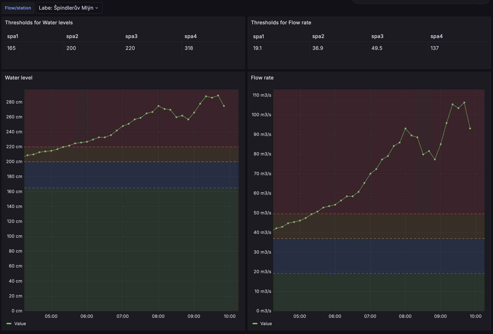

# CHMI HPPS Grafana dashboard

This is a dashboard that visualises the [CHMI HPPS](https://hydro.chmi.cz/hpps/) data in Grafana.
It consumes the [CHMI hydrology open data](https://opendata.chmi.cz/hydrology/now/) and requires no local application to run.

# Installation 101

1. [Install the Infinity Grafana plugin](https://grafana.com/docs/plugins/yesoreyeram-infinity-datasource/latest/setup/installation/)
2. Import the dashboard (it uses the default Infinity data source name)
3. Select the flow/measuring station of your wish and watch the data

# Dashboard demo

# Under the hood

The [Infinity data source](https://grafana.com/docs/plugins/yesoreyeram-infinity-datasource/latest/) plugin
fetches the data and processes them using the [JSONata query language](https://docs.jsonata.org/overview.html).

The dashboard primarily uses the Infinity data source to the open-data metadata JSON file from the URL specified by a `metadata` variable (see below), which contains the list of all flows/measuring stations.
It then builds the list of flows/stations and stores those as a variable that's visible on the dashboard, as a select box.
This list is stored in a Grafana variable called `loc`.

As the metadata file contains the current date, we use the Infinity plugin and JSONata to generate the current date as YYYYMMDD and store it to a variable called `date`.
We then use this variable to compose the metadata file URL and store it to another variable called `metadata`.

The Thresholds panels use Infinity and JSONata to load the metadata file again, and only list the thresholds for the selected flow measuring station.
The same approach is used for the threshold lines in the Water level and Flow rate panel. In this case, there's an extra transformation to show the lines.
**You need a recent version of Grafana to display the threshold lines in the right colors.**

Finally, the water levels/flow rates fetch the actual data from the CHMI open-data (the URL is computed dynamically based on the `loc` variable contents).
**The open-data only contains data for the past ~6 hours, so selecting a longer time range in Grafana doesn't help you much.**
As a rule of thumb, keep the "past 6 hours" time range, which is pre-selected in the dashboard.

# Credits

Most of the dashboard work credits go to [Jakub](https://x.com/tcpj_cz). The open-data hydrology dataset seems to be a new one, created thanks to the cooperation between the team at [Mapy.cz](https://x.com/VacekMarek/status/1834504433809474034) and [CHMI](https://www.chmi.cz/).